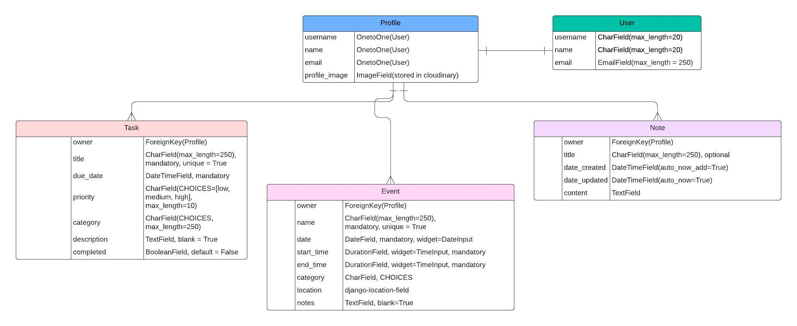

# Syncora

## Introduction

Syncora is a web application designed to help improve your productivity and organisation in day to day life. It allows you to view all your events, tasks and any notes you write down all in one place, making everything easier to find. Why not sign up today and start being the organised person you've always wanted to be?

This repository is for the back-end of the application made using the Django REST framework. The front-end of this project utitilises the React framework. The repository for the front end can be found [here](https://github.com/mariam138/syncora_react).

## Project Goals

Syncora is a web application that is the virtual version of a personal planner or diary. The primary goals of the app are:

1. Help users to stay organised by writing down tasks which need completing and any upcoming events. All of this information can then be found in one place in a much more condensed version compared to a paper diary.

2. Provide a place to write down any notes quickly and easily, compared to having to search around for a pen and paper to jot something down.

3. Provide a simple and easy to use interface, making it intuitive for anyone over the age of 13 to use.

4. Offer minimal but impactful features in an achievable development time, with the ability to further improve the app with more useful features in the future.

## Planning

Firstly, user stories were created for the frontend in order to map out which features were to be included in the project. These user stories were created based around the project goals outlined above. User stories were recorded using Github's issues and project features - the **Syncora** project board can be found [here](https://github.com/users/mariam138/projects/7).

### Data Models

Data models for the app were created using an entity relationship diagram. This diagram was created on [lucidchart](lucid.app/lucidchart).

##### Profile

This model represents the user profile, to be created upon a user registering for the site. The Profile model has a one-to-one relationship with Django's User model. From registration, the **username**, **name** and **email** fields will be used in the Profile model. A default profile image will also be used, which can then later be edited by the user. 

##### Task

The Task model has a many-to-one relationship with the *Profile* model, allowing a user to create several tasks. This many-to-one relationship is formed by the `owner` field, which is also set as the primary key of the model. A `title` field is provided to quickly name the task, and a `due_date` field also. Then the user can choose a `priority` for their task, choosing from: *low*, *medium* and *high*. A `category` can also be chosen for the task for further organisation. An optional `description` field is provided to allow the user to add any extra notes if desired. Finally, a `completed` field is provided. This is a **BooleanField** which will render as a checkbox, initially set to **False** indicating that the task is not completed.

##### Event

Like the *Task* model, the **Event** model also has a many-to-one relationship with the *User* model. This allows a user to create several events on the app. This relationship is provided by the `owner` field. A `name` is required for each event, followed by a `date`, a `start_time` and `end_time`. Events can also be categorised, providing a list of choices for the `category` field. A `location` can also be added for events, which is provided by the *django-location-field* library. Finally, a separate `notes` field is provided which is optional, allowing the user to choose whether to provide extra notes or not.

##### Note

The final custom model for the app is the **Note** model. Same as the *Task* and *Event* models, the **Note** model has a many-to-one relationship with the *Profile* model. A `title` field is provided but this field is optional, which allows a user to save time when writing a note as a title may not always be necessary. `date_created` and `date_updated` fields are part of the model. These fields aren't editable by the user, but will help in organising and filtering notes. Each time a note is updated, it will then appear at the top of the notes list unless the user chooses a different filter. Finally, the **Note** model contains a `content` field where the main body of the note will be written.

## API Endpoints

Once the user stories were created, they were then mapped out to different API endpoints and their url's. This was to help with planning which HTTP methods and views would be needed. Below is a table of all the API endpoints and which user stories they relate to.

### Profile API Endpoints

| HTTP   | URL          | CRUD Operation | CRUD Description       | View Name | User Story    |
| ------ | ------------ | -------------- | ---------------------- | --------- | ------------- |
| GET    | /profile/:id | read           | retrieve profile by id | DETAIL    | #36           |
| PUT    | /profile/:id | update         | edit profile by id     | DETAIL    | #35, #37      |
| DELETE | /profile/:id | delete         | delete profile by id   | DETAIL    | #19, #20, #21 |

### Task API Endpoints

|        |            |                |                                  |           |                    |
| ------ | ---------- | -------------- | -------------------------------- | --------- | ------------------ |
| HTTP   | URL        | CRUD Operation | CRUD Description                 | View Name | User Story         |
| GET    | /dashboard | read           | view list of tasks on dashboard  | LIST      | #23                |
| GET    | /tasks     | read           | view list of tasks on tasks page | LIST      | #30, #40           |
| GET    | /tasks/:id | read           | view task detail by id           | DETAIL    | #39                |
| POST   | /tasks     | create         | create a new task                | LIST      | #38, #44, #46, #27 |
| PUT    | /tasks/:id | update         | edit or update a task by id      | DETAIL    | #41, #43           |
| DELETE | /tasks/:id | delete         | delete a task by id              | DETAIL    | #42                |

### Event API Endpoints

| HTTP   | URL         | CRUD Operation | CRUD Description                   | View Name | User Story         |
| ------ | ----------- | -------------- | ---------------------------------- | --------- | ------------------ |
| GET    | /dashboard  | read           | view list of events on dashboard   | LIST      | #22                |
| GET    | /events     | read           | view list of events on events page | LIST      | #29, #52           |
| GET    | /events/:id | read           | view event detail by id            | DETAIL    | #51                |
| POST   | /events     | create         | create a new event                 | LIST      | #50, #26, #55, #57 |
| PUT    | /events/:id | update         | update an event by id              | DETAIL    | #53                |
| DELETE | /events/:id | delete         | delete a task by id                | DETAIL    | #54                |

### Note API Endpoints

| HTTP   | URL        | CRUD Operation | CRUD Description                 | View Name | User Story |
| ------ | ---------- | -------------- | -------------------------------- | --------- | ---------- |
| GET    | /dashboard | read           | view list of notes on dashboard  | LIST      | #24        |
| GET    | /notes     | read           | view list of notes on notes page | LIST      | #31, #66   |
| GET    | /notes/:id | read           | view note detail by id           | DETAIL    | #65        |
| POST   | /notes      | create         | create a new note                | LIST      | #28, #64   |
| PUT    | /notes/:id | update         | edit a note by id                | DETAIL    | #67, #71   |
| DELETE | /notes/:id | delete         | delete a note by id              | DETAIL    | #68        |

Tables were converted to markdown syntax using [tabletomarkdown](https://tabletomarkdown.com/). The tables can also be viewed [here](https://docs.google.com/spreadsheets/d/1CRyoUpEjVBolPIXQgQctQdQ-qx7E5KorJemjMhpCZus/edit?usp=sharing) on Google Sheets.

## Frameworks, libraries and dependencies

The **Syncora** API is created with Python using Django 5.0 and the Django REST Framework 3.5.12. The following additional dependencies were also used in creating the API:

- **Cloudinary 1.41.0** - To allow storage of profile pictures when users upload a new one
- **django-cloudinary-storage 0.3.0** - To allow integration of storage with the Django framework
- **Pillow 10.4** - For use with Django's ImageField, as recommended by the django-cloudinary-storage docs
- **dj-database-url** - To connect to my extgernal postgreSQL database using a URL
- **psycopg2** - Used as a PostgreSQL database adapter when connecting to the external database
- **dj-rest-auth** - For use in providing REST API endpoints for user registration and authentication
- **django-allauth** - Although not explicitly used in this API, it is used in conjunction with *dj-rest-auth* to include registration functionality, as suggested by the documentation.
- **djangorestframework-simplejwt 5.3.1** - To allow use of JSON web tokens in the production version of the API
- **django-cors-headers 4.4.0** - To add Cross-Origin Resource Sharing (CORS) headers to responses, allowing in-browser requests from other origings
- **gunicorn 23.0.0** - For use with serving the API on a web framework

## Testing

### Manual Testing

Manual testing took place throughout development of the app, for both front-end and back-end.

### Automated Testing

### Python Validation

## Bugs

## Deployment

The following steps were followed in order to deploy the API onto Heroku:

1. From the Heroku dashboard, click **'New*'* and then select *'Create new app'*
2. Enter an app name (In this case, *syncora-api*) and choose a region. For this app, *Europe* was chosen as the region.
3. Click the **Create app** button at the bottom of the page
4. On the app, access the **Deploy** tab. Choose **GitHub** as the deployment method to connect to your GitHub account.
5. Connect to the repository to connect the app through GitHub.
6. Access the **Settings** tab. Click **Reveal Config Vars** to create your own environment variables.
7. Set up variables for your *Cloudinary* API, your database and your secret key. 
8. Ensure all code is pushed to GitHub before deployment.
9. Going back to the **Deploy** tab, scroll to the bottom to the *'Deploy a GitHub branch* setting.
10. Click **Deploy Branch** ensuring the branch is set to *main*.

## Credits

### Media

- Default avatar icon is by [Dixit Lakhani_02](https://www.freepik.com/icon/user_8407889#fromView=search&page=1&position=29&uuid=d6bcc367-7dd9-404e-b466-6f8daca02ae7) on freepik.com

### Code

- Code for signals to create a Profile instance whenever a user registers is adapted from [this post](https://dev.to/earthcomfy/django-user-profile-3hik) by Hana Belay on **dev.to**
- Code to create the **`IsOwnerOrReadOnly`** custom permission class is adapted from the Django REST framework documentation [here](https://www.django-rest-framework.org/tutorial/4-authentication-and-permissions/#object-level-permissions)
- Code to check if the currently logged in user is the owner of the profile is adapted from **Code Institute**'s 'Authentication, authorization and serializer method fields' video in the Django REST Framework module
- Code to create a custom register serializer, used with django-rest-auth, to make sure a first name is mandatory is adapted from [this](https://stackoverflow.com/questions/62291394/django-rest-auth-dj-rest-auth-custom-user-registration) and related comments on *stackoverflow*