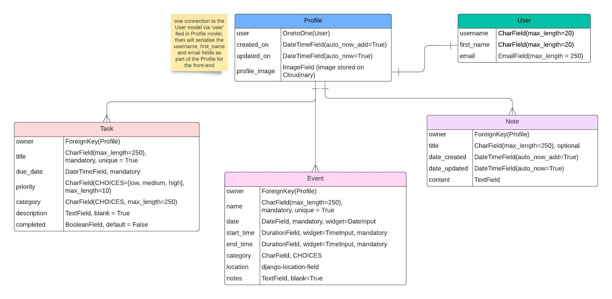

# Syncora

## Introduction

Syncora is a web application designed to help improve your productivity and organisation in day to day life. It allows you to view all your events, tasks and any notes you write down all in one place, making everything easier to find. Why not sign up today and start being the organised person you've always wanted to be?

This repository is for the back-end of the application made using the Django REST framework. The front-end of this project utitilises the React framework. The repository for the front end can be found [here](https://github.com/mariam138/syncora_react).

## Project Goals

Syncora is a web application that is the virtual version of a personal planner or diary. The primary goals of the app are:

1. Help users to stay organised by writing down tasks which need completing and any upcoming events. All of this information can then be found in one place in a much more condensed version compared to a paper diary.

2. Provide a place to write down any notes quickly and easily, compared to having to search around for a pen and paper to jot something down.

3. Provide a simple and easy to use interface, making it intuitive for anyone over the age of 13 to use.

4. Offer minimal but impactful features in an achievable development time, with the ability to further improve the app with more useful features in the future.

## Planning

Firstly, user stories were created for the frontend in order to map out which features were to be included in the project. These user stories were created based around the project goals outlined above. User stories were recorded using Github's issues and project features - the **Syncora** project board can be found [here](https://github.com/users/mariam138/projects/7).

### Data Models

Data models for the app were created using an entity relationship diagram. This diagram was created on [lucidchart](lucid.app/lucidchart).

##### Profile

This model represents the user profile, to be created upon a user registering for the site. The Profile model has a one-to-one relationship with Django's User model. From registration, the **username**, **name** and **email** fields will be used in the Profile model. A default profile image will also be used, which can then later be edited by the user. 

##### Task

The Task model has a many-to-one relationship with the *Profile* model, allowing a user to create several tasks. This many-to-one relationship is formed by the `owner` field, which is also set as the primary key of the model. A `title` field is provided to quickly name the task, and a `due_date` field also. Then the user can choose a `priority` for their task, choosing from: *low*, *medium* and *high*. A `category` can also be chosen for the task for further organisation. An optional `description` field is provided to allow the user to add any extra notes if desired. Finally, a `completed` field is provided. This is a **BooleanField** which will render as a checkbox, initially set to **False** indicating that the task is not completed.